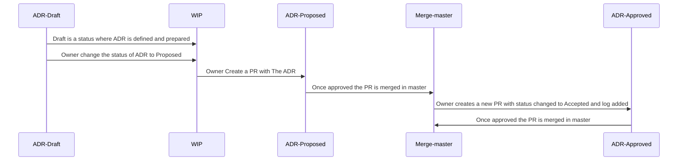

# ADR process flow

This documentation explain the adr lifecycle and represents the guide for owners to create an maintain an ADR

### adr Folder structure

In this repository **adr** is the main folder where all ADRs will be added and maintained
Folder structure for ADR's and important files:
- template.md - Template md file to follow to create ADR. Each ADR will created by copy and edit the template
- add-flow-readme.md - current documentation of adr flow. This file must updated in case flow will change.
- ADRs will be created under adr folder. Owner can choose to create any other folder structure as follow:
   - new folder will be created under adr folder only
   - naming convention for folders: small letters delimited by -
   - suggestive folder name that address the adr based on modules
     **Example:** user-management, raiting-module, logs etc
   - in case adr contains images linked the images folder will be created and will have all images linked in ADR    
     **Example**: 

-------------------------------
# ADR Management

Markdown files will be used as a documentation.

For detail information of create markdown documentation file please refer the available documentation on GitHub

[Start writing on GitHub](https://docs.github.com/en/get-started/writing-on-github/getting-started-with-writing-and-formatting-on-github) and [Work with advanced formatting](https://docs.github.com/en/get-started/writing-on-github/working-with-advanced-formatting)

To easily manage over time the ADRs the next conventions and patterns will be followed:

## 1. ADR naming convention
**File name pattern**: xxxx_action_title.md ([Documentation used](https://github.com/joelparkerhenderson/architecture-decision-record?tab=readme-ov-file#file-name-conventions-for-adrs))
-  The name has a present tense imperative verb phrase. This helps readability and matches our commit message format.
-  The name uses lowercase and dashes (same as this repo). This is a balance of readability and system usability.
-  The extension is markdown. This can be useful for easy formatting.

## 2. ADR status
ADR process must follow a certain procedure to be adopted.

### Status options:

**a. Draft** - this is a pre-status that permits architects to share in preview their ADR.

**b. Proposed** - this is a status that marks ADR ready to be voted

**c. Accepted** - this is the final status of an ADR after was approved by at least 2 reviewers

**d. Deprecated** - this status will be used for ADRs that have architectural changes on the current system and is associated with a new ADR that describe the new changes. Deprecated ADR will have a reference link to the new ADR

**e. Suspended** - status will contain the reference of the ADR that replace and the suspending reason

:writing_hand: **Notes:** Based on the needs any other status can be added


## 3. Log Accepted and Deprecated ADRs

Owner of ADR must add log for his Accepted adr or for ADRs that become Deprecated. The log is added when the PR with Accepted / Deprecated status is created as is described in the next section ( 4. Owners in approvals). After final PR is merged into master the log will be deleted automatically via pipeline

Copy and paste the code below and update the log information

### For Accepted ADR

```
```

### For Deprecated ADR

```
```

**Example of ADR log in PR - before merge in main**

**Example of ADR in main branch - after merge**


## 4. Owners in approvals
The creator of ADR is responsible to drive the process of the ADR until the final status.

Actions needed:
- request approvals (via pull request)
- once ADR is approved and merged to master, Create a new PR with hte next changes
    - manually change status of ADR 
    - add logs of Accepted and Deprecated status (other status changed will not be added to log)

## 4 ADR Flow Diagram

### Approved ADR flow


